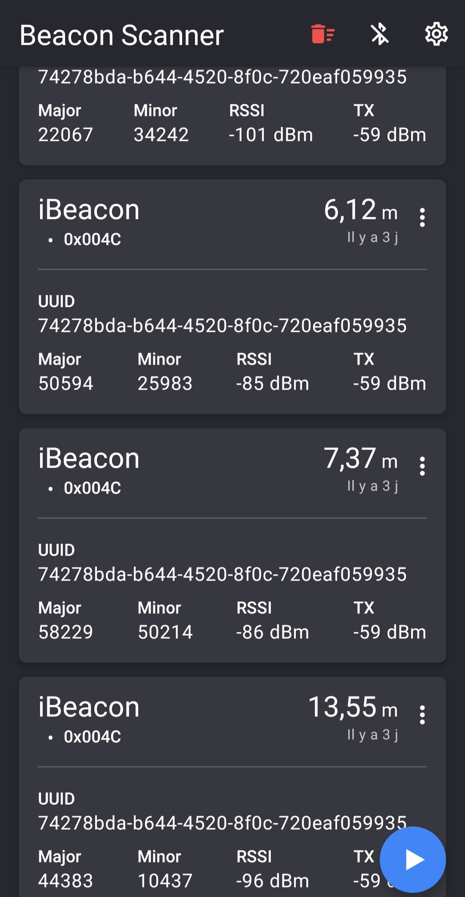

# Beacons

#### Write-up par Balr0g404 - HackSécuReims2020


En débutant ce challenge, on récupère trois fichiers : 

- **flag1.txt.enc**, qui contient la première partie du flag chifrée
- **flag2.txt.enc**, qui contient la deuxième partie du flag chifrée
- **decrypt.py** 

Le code du script est le suivant :

```python
# This script is using Python 2.7

import os, random, struct, sys
from Crypto.Cipher import AES

def decrypt_file(key, in_filename, out_filename=None, chunksize=24*1024):
    """ Decrypts a file using AES (CBC mode) with the
        given key. Parameters are similar to encrypt_file,
        with one difference: out_filename, if not supplied
        will be in_filename without its last extension
        (i.e. if in_filename is 'aaa.zip.enc' then
        out_filename will be 'aaa.zip')
    """
    if not out_filename:
        out_filename = os.path.splitext(in_filename)[0]

    with open(in_filename, 'rb') as infile:
        origsize = struct.unpack('<Q', infile.read(struct.calcsize('Q')))[0]
        iv = infile.read(16)
        decryptor = AES.new(key, AES.MODE_CBC, iv)

        with open(out_filename, 'wb') as outfile:
            while True:
                chunk = infile.read(chunksize)
                if len(chunk) == 0:
                    break
                outfile.write(decryptor.decrypt(chunk))

            outfile.truncate(origsize)


# Arg1 is the key. The format is : AA1122334455667788 (16 hex)
# Arg2 : the file that you want to decrypt

key = sys.argv[1];
filename = sys.argv[2];

print("Key : "+key);
print("Filename : "+filename);

decrypt_file(key, filename);

```

On voit rapidement que ce script permet de déchiffrer un fichier chiffré avec AES. Il prend en argument une clé sous forme de 16 caractères hexadécimaux et le chemin vers le fichier à déchiffrer.

Le challenge va donc consister à trouver les deux clés nous permettant de déchiffrer les deux morceaux du flag. 

Ce challenge étant en catégorie IoT, et s'appelant "beacon", on se doute qu'il va falloir bouger afin de capter avec notre téléphone des balises dispersée dans la salle. 

On installe sur notre téléphone l'application **Beacon Scanner** qui nous permet de détécter les balises Bluetooth alentours. Une fois l'application installée et un tour de la salle effectué, on obtient les informations suivantes :




On retrouve bien toutes les informations classiques d'une balise Bluetooth :

- Un UUID (**U**niversally **U**nique **Id**entifier) qui identifie le fabricant de la balise
- Une **major** et une **minor**, deux valeurs qui permettent de différencier chaque balise

Les valeurs des major et des minor sont stockées sur **16** bits, elle peuvent donc prendre des valeurs entre 0 et 65535. Dans notre cas, on remarque que chaque valeur possède 5 chiffres en base 10, on peut donc toutes les coder en héxadécimal pour se rendre compte que chacune fait 4 caractères hexadécimaux. 

On a donc 4 balises, avec des major et des minor longues de 4 caractères hexadécimaux, on peut donc raisonnablement penser que deux des associations possibles de ces valeurs forment les clés AES dont on a besoin.

On va donc écrire un petit script qui va nous calculer toutes les clés possibles et tenter de déchiffrer le flag, en sachant qu'il doit commencer par **HSR** et finir par **}**:

```python
#!/usr/bin/env python3
# -*- coding: utf-8 -*-

import os
import time

major = ["C5A2","E375","AD5F","5633"]
minor = ["657F","C426","28C5","85C2"]

pkeys = []

for a in range(4):
    for b in range(4):
        for c in range(4):
            for d in range(4):
                pkeys.append(major[a]+minor[b]+major[c]+minor[d])
                pkeys.append(minor[a]+major[b]+minor[c]+major[d])
                pkeys.append(minor[a]+minor[b]+major[c]+major[d])
                pkeys.append(major[a]+major[b]+minor[c]+minor[d])


for key in pkeys:
    os.system("python decrypt.py "+key+" flag1.txt.enc && grep HSR flag1.txt")
    os.system("python decrypt.py "+key+" flag2.txt.enc && grep } flag2.txt")
```

Enjoy ! L'output n'est pas très beau, mais le programme est fonctionnel :)

Juste pour le fun, voici un programme en go qui fait la même chose :

```go
package main

import (
	"fmt"
	"os/exec"
	"os"
	)


func decryptf1(key string) {
	command := "python decrypt.py "+string(key)+ " flag1.txt.enc && grep HSR flag1.txt"
	cmd := exec.Command("bash", "-c", command)
	cmd.Stdout = os.Stdout
	cmd.Stderr = os.Stderr
	err := cmd.Run()

	if err != nil {
		fmt.Sprintf("Error %s", err)
	}
}

func decryptf2(key string) {
	command := "python decrypt.py "+string(key)+ " flag2.txt.enc && grep } flag2.txt"
	cmd := exec.Command("bash", "-c", command)
	cmd.Stdout = os.Stdout
	cmd.Stderr = os.Stderr
	err := cmd.Run()

	if err != nil {
		fmt.Sprintf("Error %s", err)
	}
}

func main(){

major := [4]string{"C5A2","E375","AD5F","5633"}
minor := [4]string{"657F","C426","28C5","85C2"}
var pkeys []string

for a := 0; a < 4; a++ {
	for b:= 0; b < 4; b++ {
		for c := 0; c < 4; c++ {
			for d := 0; d < 4; d++ {
				pkeys = append(pkeys, major[a]+minor[b]+major[c]+minor[d])
				pkeys = append(pkeys, minor[a]+major[b]+minor[c]+major[d])
				pkeys = append(pkeys, minor[a]+minor[b]+major[c]+major[d])
				pkeys = append(pkeys, major[a]+major[b]+minor[c]+minor[d])
				}
			}
		}
	}

for _ , value := range pkeys{

	go decryptf1(string(value))
	decryptf2(string(value))

	}
}

```

