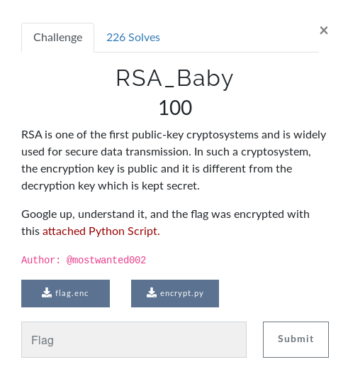

# WU RSA_baby

#### Written and solved by Balr0g404



For this challenge, we were given a script which has been used to encrypt a message with the **RSA algorithm**. The script is the following:

```Python
from Crypto.PublicKey import RSA
from Crypto.Util.number import *
import gmpy2
import os

flag = open("flag.txt",'r')

p = getPrime(512)
q = 9896984395151566492448748862139262345387297785144637332499966426571398040295087125558780121504834847289828037371643927199404615218623314326851473129699891
n = p*q
e = 65537
phi = (p-1)*(q-1)
d = gmpy2.invert(e,phi)

message = bytes_to_long(flag.read())

ciphertext = pow(message,e,n)
ciphertext = long_to_bytes(ciphertext).encode('hex')

encrypt = open("flag.enc",'w')

encrypt.write("ciphertext: \n" + ciphertext + "\nn: " + str(n))
encrypt.close()
flag.close()
os.remove("./flag.txt")

```

We know how RSA works: we have to choose two huge prime numbers $p,q$, to compute their product $n$, to choose an exponant $e$ such as $e < \varphi(n) \text{ and }gcd(e,\varphi(n)) = 1$, where $\varphi(n)$ respresents the Euler's totient function. We have then to compute the inverse $d = e^{-1} \text{ mod } n$. 

To encrypt a message $m$, we just have to compute $m^e \text{ mod } n$, and to decrypt a message $c$, we have to compute $c^d \text{ mod } n$.

The strengh of RSA is that, if the two prime numbers are big enough, it is barely impossible in human time to factorize the $n$ to retrieve them, so that we can't create the $e$.

But here, we are given the $n$ and one of the two prime numbers, we can then easily compute the second prime number. This is then easy to create a new exponant to decrypt the message. Here is a python programm doing that:

```Python
#!/usr/bin/python
#coding: utf-8

from Crypto.PublicKey import RSA
from Crypto.Util.number import *
import gmpy2

q = 9896984395151566492448748862139262345387297785144637332499966426571398040295087125558780121504834847289828037371643927199404615218623314326851473129699891
n = 128966395847456823242327968366437151626287005604571543530020807653481854634432463567505579255075400846802686923763465498393221683867550824071176953747390881926123454738359879186455681851356414261155283802414873885574172144840447882087969615781486331849798315912869390710865738157974501171665601011723385435523
p = n/q
e = 65537
phi = (p-1)*(q-1)
d = gmpy2.invert(e,phi)

ciphertext = '1899b6cd310966281b1593a420205588f12ab93af850ad7d9d810a502f6fe4ad93a58b5bbb747803ba33ac94cc5f227761e72bdd9857b7b0227f510683596791526b9295b20be39567fc9a556663e3b0e3fcc5b233e78e38a06b29314d897258fbe15b037d8ff25d272822571dd98dfa4ee5d066d707149a313ad0c93e79b4ee'

message = bytes_to_long(ciphertext.decode('hex'))
plaintext = pow(message,d,n)
plaintext = long_to_bytes(plaintext)

print plaintext

```

Enjoy !

Flag: encryptCTF{74K1NG_B4BY_S73PS}
