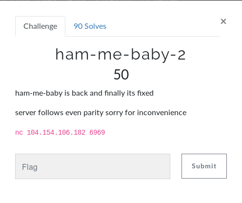
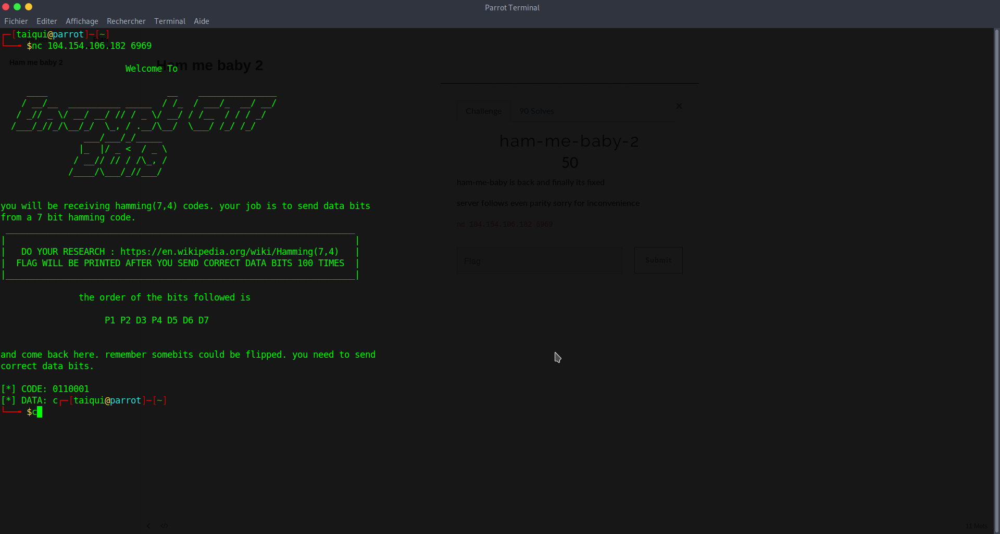

# Ham me baby 2 





Here we can see it's hamming code(7,4) we just need to send the data which was transmitted 

Mathematic are clearly not my strong but some algorithm exist, i didn't found code on github so i just take the JS code on :

```http
https://toolmenow.com/34/Hamming(7,4)-Code-Calculator

```

and convert to python programme :

```python
import socket
import sys
import requests

def evenOneChecker(number):
	return number%2==0

def hammingCheck(number):
	if(len(number) == 7):
		ca = '0'
		cb = '0'
		cc = '0'
    	if evenOneChecker(int(number[0])+int(number[2])+int(number[4])+int(number[6])) == False:
    		ca='1'

    	if  evenOneChecker(int(number[1])+int(number[2])+int(number[5])+int(number[6])) == False:
    		cb='1'

    	if evenOneChecker(int(number[3])+int(number[4])+int(number[5])+int(number[6])) == False:
		    cc='1'

	positionOfError = ["000","100","010","110","001","101","011","111"]
	encode = ["000","P1","P2","D3","P4","D5","D6","D7"];
	index = 0
	for i in range (len(positionOfError)):
		if(positionOfError[i]==(ca+cb+cc)):
			index = i
			break


	if (index == 0) :
		return (number[2]+number[4]+number[5]+number[6])
	else:
            if number[index-1]=='0':
                number = number[0:index-1]+'1'+number[index:]
            else:
                number = number[0:index-1]+'0'+number[index:]
            return (number[2]+number[4]+number[5]+number[6])


def netcat(hostname, port):
    s = socket.socket(socket.AF_INET, socket.SOCK_STREAM)
    s.connect((hostname, port))
    while 1:
        data = s.recv(1024)
        if data == "":
            break
        print "Received:", repr(data)

        if 'CODE:' in data:
            question = data.split('CODE: ')[1].split('\n')[0]
            print 'question'+question
            print 'hamming'+hammingCheck(question)
            s.send(hammingCheck(question)+'\n')
            
    print "Connection closed."
    s.close()

netcat('104.154.106.182',6969)
```

Execute and get : **here's your flag: encryptCTF{1t_w4s_h4rd3r_th4n_1_th0ught}**

