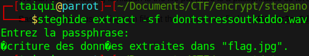

# Stress Out

In the beggining we get a *WAV* file which can't be read. 

First thing to do with stegano : **STEGHIDE** 

We can see that something is hidden in the file but there is a passphrases, so let's find it out.

Basic technique, use strings on file, at the end we can find : **1_4M_Str3ss3d_0ut**

the only weird sentence in *l33t* : **1_4M_Str3ss3d_0ut**

i'm lucky it's the password :

Second round, we get a png picture : 

 

On this picture, steghide give us nothing, no in metadata ...

Recently I have made a script wich applies the lsb stegano technique on picture which was useful to me, it makes 7 picture based on lsb technique, first picture with 1 lsb, second with 2 lsb etc... and on one picture we can see : 

We got it ! 

flag : **encryptCTF{tyl3r_j0s3ph_1s_1_g0d}**

\*\*ps weird thing, if i open original picture on my laptop, i juste see the picture but if i open it on my computer i clearly see the flag
