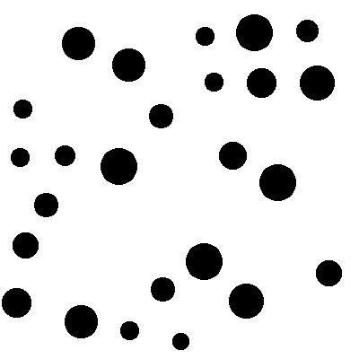

# Sight_of_Last

On this challenge, we used netcat to have the following : 


Following by image encoded in base64.

This image looks like : 



So according to netcat response, we need to find the minimum distance between the centers of two circles:

I make this script which run through the images, when he detects black pixel, it continue untils white pixel, then the program backs to previous pixel ( black ) and go down untils white pixel etc to form a square in the circle, I calculate middle of square to find middle of circle and did this on full images to find all circle's center.

I remove coordinate which are ~equals and point which are not black pixel

and I gate the flag ! 

```text
flag : tjctf{i5_th1s_c0mput3r_v1si0n?}
```

program : [findcenter.py](file:./findcenter.py)

